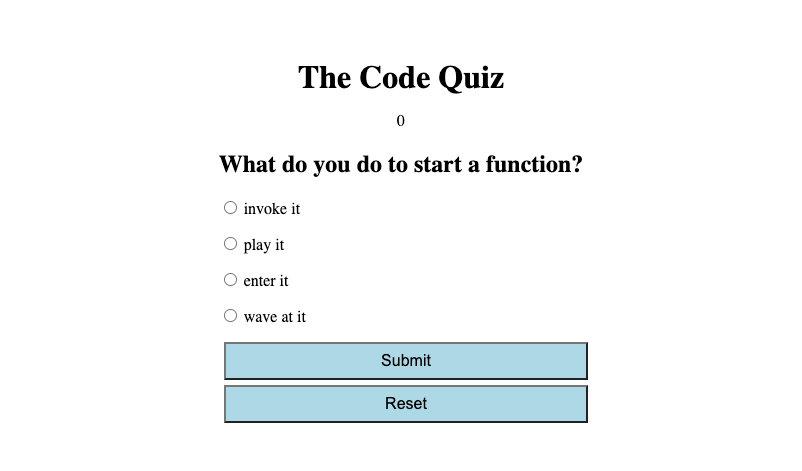

# Code Quiz

## How It Works

This is a timed quiz to test your coding knowledge. The timer starts when you click the start/submit button on the first question. You will be given 4 multiple choice questions with 4 options per question.  The quiz will be over after you've answered all of the questions or your time runs out. Please add your initials at the end of your quiz.  

## Key Functions

After choosing your answer, click the submit button to proceed to the next question.  Click the reset button startover.

mysql-8.0.31-macos12-x86_64

image.png

